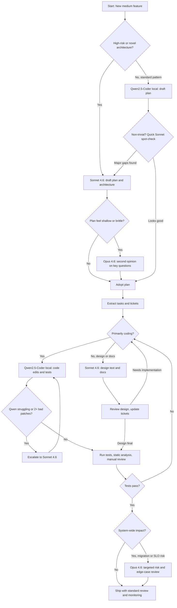

# LLM Pick Flow

```mermaid
flowchart TD
    A[Start: New medium feature] --> B{High-risk or novel architecture?}

    B -->|Yes| C[Sonnet 4.6: draft plan and architecture]
    B -->|No, standard pattern| D[Qwen2.5-Coder local: draft plan]

    C --> E{Plan feel shallow or brittle?}
    E -->|Yes| F[Opus 4.6: second opinion on key questions]
    E -->|No| G[Adopt plan]
    F --> G

    D --> D1{Non-trivial? Quick Sonnet spot-check}
    D1 -->|Major gaps found| C
    D1 -->|Looks good| G

    G --> I[Extract tasks and tickets]

    I --> J{Primarily coding?}
    J -->|Yes| K[Qwen2.5-Coder local: code edits and tests]
    J -->|No, design or docs| L[Sonnet 4.6: design text and docs]

    K --> M{Qwen struggling or 2+ bad patches?}
    M -->|Yes| N[Escalate to Sonnet 4.6] --> K
    M -->|No| R[Run tests, static analysis, manual review]

    L --> P[Review design, update tickets]
    P -->|Needs implementation| J
    P -->|Design final| R

    R --> R1{Tests pass?}
    R1 -->|No| J
    R1 -->|Yes| S{System-wide impact?}

    S -->|Yes, migration or SLO risk| T[Opus 4.6: targeted risk and edge-case review]
    S -->|No| U[Ship with standard review and monitoring]
    T --> U
```
